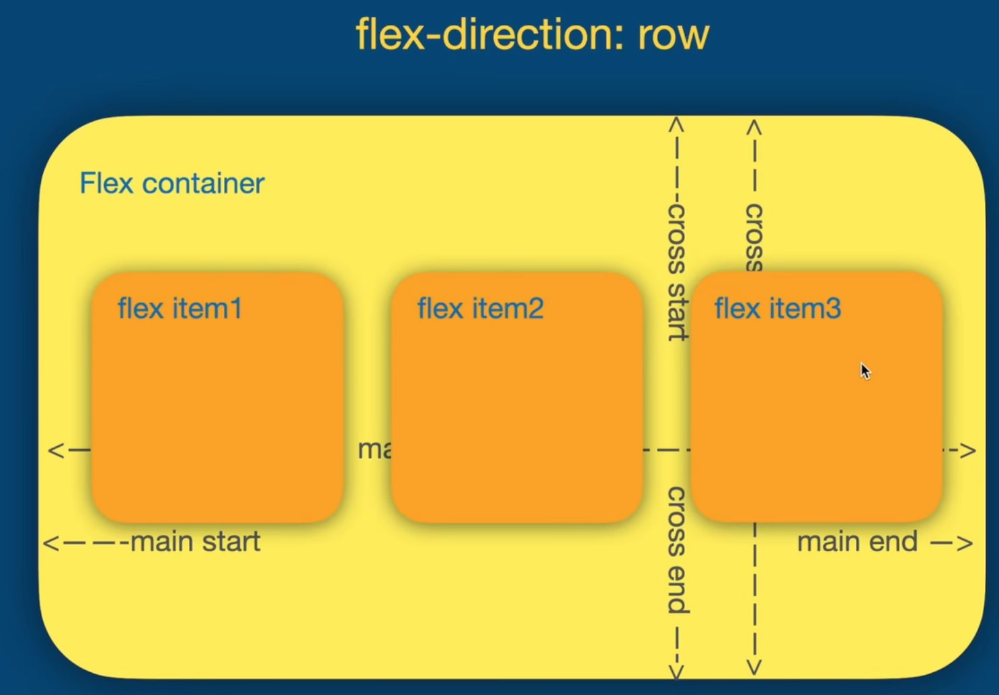
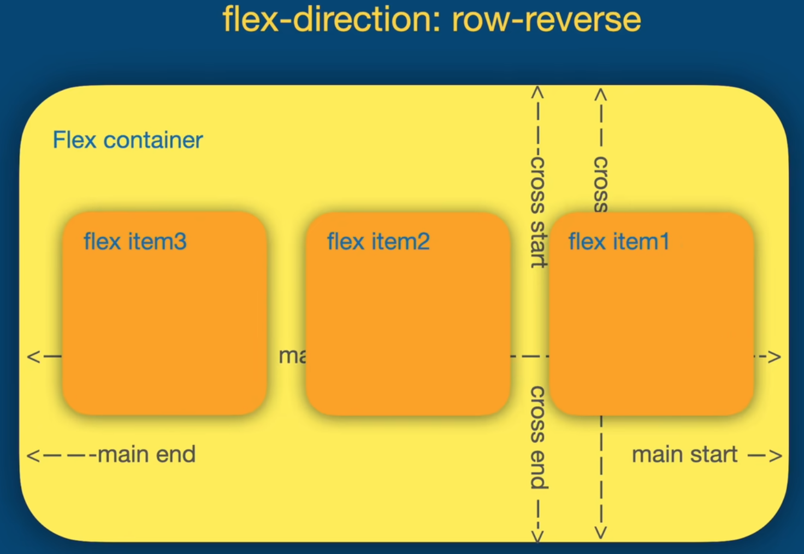
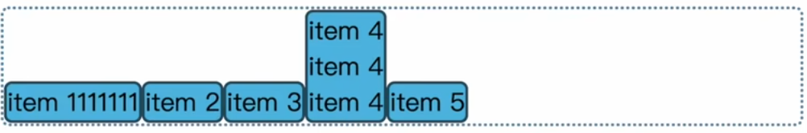
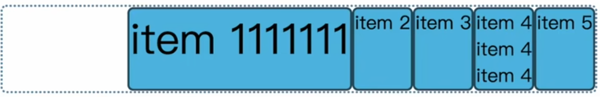
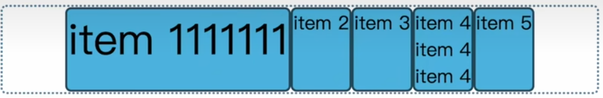
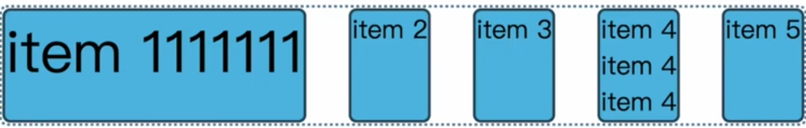
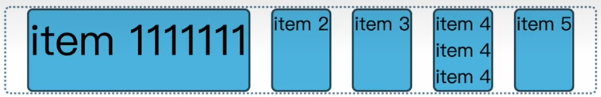

## CSS flex
```css
display:flex 
```

### `flex-direction`
```css
 flex-direction:row
```

```css
 flex-direction:row-reverse
```

```css
 flex-direction:column
```

```css
 flex-direction:column-reverse
```

## `flex-basis`&`flex-grow`&`flex-shrink`
```css
.container{
    display:flex;
    width:500px;
}
.item{
    flex-basis:50px;
    /*flex-basis represents the width of the flex element
    if it is set to auto, it's the same as min-content, which equals to the length of the longest word in the text.
    you can also use width instead of flex-basis*/
    flex-grow:1;
}
.item:nth-child(1){
    flex-grow:6
}
/* 4(50+x)+50+6x=500 */
/*you can set flex-basis to 0 to make the width of the first child 6 times the others.*/
```
`flex-shrink` is the minus version of `flex-grow`  

`flex: grow shrink basis`  
```css
flex:initial;
/*flex: 0 1 auto*/
flex:auto;
/*flex: 1 1 auto*/
flex:none;
/*flex: 0 0 auto*/
flex:1 0px;
/*devide into equal parts*/
```
### `align-items`
manipulate cross axis
```css
.container{
    display:flex;
    width:500px;
    align-items:stretch
    /*'stretch is the 'default value, meaning stretching other elements'height to that of the highest element*/
}
```
```css
align-items:flex-start;
align-items:flex-end;
align-items:center;
align-items:baseline;
```




### `justify-content`
manipulate the main axis
```css
justify-content:flex-start
justify-content:flex-end
justify-content:center
justify-content:space-between
justify-content:space-around
justify-content:space-evenly
```





