# CSS入门
不涉及动画`Transition`和`Animation`，大家可以自行搜索学习
## CSS简述
- Cascading Stylesheets（层叠样式表）
- **不是**编程语言，不能处理逻辑
- 告诉浏览器如何指定样式和布局
## 导入CSS
将CSS应用于HTML
一般我们将CSS单独写于一个文件中，在HTML中通过`<link>`引用
```html
<html>
  <head>
    <title>柚子厨蒸鹅心</title>
    <link href="./css/style.css">
  </head>
</html>
```
## CSS选择器
```html
<div class="box" id="box1" title="genshin">原神，启动</div>

```
原则上可以有很多元素在同一个类中，但是每一个id只能对应一个元素。当然有些时候会因为一些反爬虫技术使多个元素共享一个id，但是这是不符合规范的。
### 元素选择器
```css
div {
    color:red;
}
```
### 类选择器
```css
.box {
    color:red;
}
```
### id选择器
```css
#box1 {
    color:red;
}
```
### 属性选择器
```css
/* 存在 title 属性的 <div> 元素 */
div[title] {
  color: purple;
}

/* 存在 title 属性并且属性值匹配"genshin"的 <div> 元素 */
div[title="genshin"]
{
  color: green;
}
```
### `,`
```css
img,.box {
  border: red 2px solid;
}
```
可以使用`,`同时使用多个选择器，但是使用选择器列表的一个缺点是选择器列表中的**单个不受支持的选择器会使整个规则无效化**。
### 组合器
### 空格`" "`
“ ”（空格）组合器选择前一个元素的后代节点。
`div span` 匹配所有位于任意 `<div>` 元素之内的 `<span>` 元素。
### `>`
`>` 组合器选择前一个元素的直接子代的节点。
`ul > li` 匹配直接嵌套在 `<ul>` 元素内的所有 `<li>` 元素。
### `~`
`~` 组合器选择兄弟元素，也就是说，后一个节点在前一个节点后面的任意位置，并且共享同一个父节点。
`p ~ span` 匹配同一父元素下，`<p>` 元素后的所有 `<span>` 元素。
### `+`
`+` 组合器选择相邻元素，即后一个元素紧跟在前一个之后，并且共享同一个父节点。
`h2 + p` 会匹配紧邻在 `h2` 元素后的第一个 `<p>` 元素。
## 伪类
### `:hover`
用户将光标（鼠标指针）悬停在元素上时触发。
```html
<p>求是潮mobile手机站</p>
```
```css
p {
  background-color: powderblue;
  transition: background-color 0.5s;
}

p:hover {
  background-color: gold;
}
```
### `:nth-child()`
`:nth-child()` 伪类根据元素在父元素的子元素列表中的索引来选择元素。换言之，`:nth-child()` 选择器根据父元素内的所有兄弟元素的位置来选择子元素。
```html
<p>Track & field champions:</p>
<ul>
  <li>Adhemar da Silva</li>
  <li>Wang Junxia</li>
  <li>Wilma Rudolph</li>
  <li>Babe Didrikson-Zaharias</li>
  <li>Betty Cuthbert</li>
  <li>Fanny Blankers-Koen</li>
  <li>Florence Griffith-Joyner</li>
  <li>Irena Szewinska</li>
  <li>Jackie Joyner-Kersee</li>
  <li>Shirley Strickland</li>
  <li>Carl Lewis</li>
  <li>Emil Zatopek</li>
  <li>Haile Gebrselassie</li>
  <li>Jesse Owens</li>
  <li>Jim Thorpe</li>
  <li>Paavo Nurmi</li>
  <li>Sergei Bubka</li>
  <li>Usain Bolt</li>
</ul>
```
```css
p {
  font-weight: bold;
}

// An+B类
li:nth-child(-n + 3) {
  border: 2px solid orange;
  margin-bottom: 1px;
}

li:nth-child(even) {
  background-color: lightyellow;
}
```
## 伪元素`::before`和`::after`
课上不做讲解，大家可以自行观看文档或视频
可以用于制作一些比较高级的效果
[CSS中的before和after](https://www.bilibili.com/video/BV13y411q7aJ/?spm_id_from=333.788&vd_source=65f184ce09799659e15dcaec4de0a855)
## 颜色
- 关键字`blue`,`red`等
- RGB`rgb(255,0,0)`
- RGBA`rgb(255,0,0,0.5)`，A代表透明度
- 16进制值`#ff0000`
- HSL,HSLA等
### 背景颜色
```css
background-color: white;
```
### 容器内的文字颜色
```css
color: red;
```
## 文本
### 字体
```css
font-family: “Times New Roman", serif;
```
如果 Times New Roman 字体在用户的计算机上不可用，浏览器将尝试使用下一个可用的字体(serif)，或者使用默认的 sans-serif 字体。
### 字的大小
```css
font-size: 20px;
```
### 字的粗细
```css
font-weight: bold;
```
### 行距
```css
line-height: 1.6em;
```
1em 等于当前元素的字体大小
### 其他
```css
text-decoration: underline;
font-style: italic;
letter-spacing: 1em;
word-spacing: 2em;
```
## 盒子模型
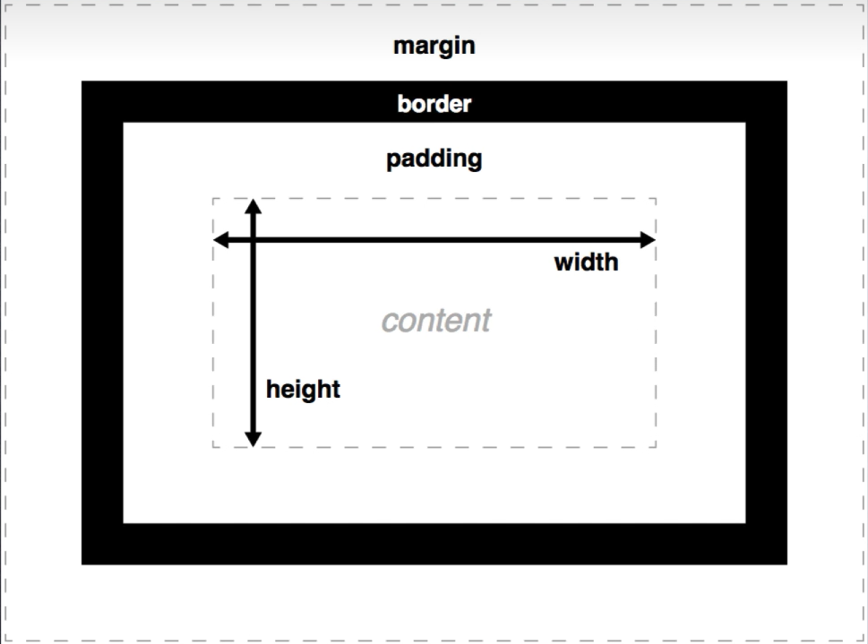
html每一个元素都可以视为一个盒子模型
margin,border,padding中文可以译为外边距、边框、内边距
### margin
margin具有外边距塌陷的性质
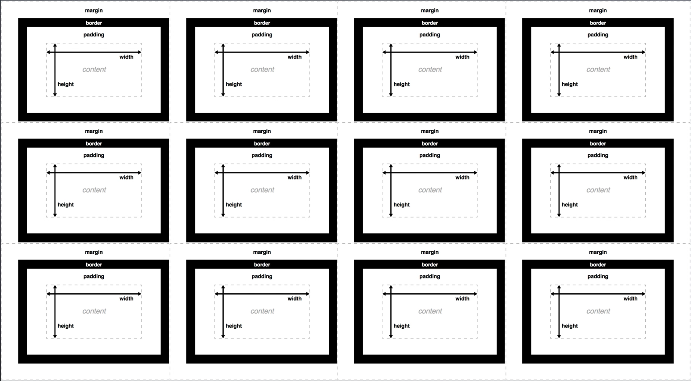
```css
p {
  margin-top: 5px;
  margin-right: 10px;
  margin-left: 6px;
  margin-bottom: 7px;
}
```
### border
border的一个区别于margin和border的显著特征是其可以被着色
```css
p {
  border-left-width: 6px;
  border-left-color: red;
  border-left-style: dashed;

  border-color: red;
  border-left: 6px red dashed;
  border-radius: 3px;
}
```
### padding
```css
p {
  padding-top: 5px;
  padding-right: 10px;
  padding-left: 6px;
  padding-bottom: 7px;
}
```
值得一提的是，以上的以`px`为单位的地方大部分都可以改为百分数，如
```css
p {
  padding-top: 5%;
}
```
5%指的是`<p>`元素**父元素**的**宽度**的5%。这意味着`<p>`元素的上内边距（padding-top）将设置为其父元素**宽度**的5%。
在实际的编写过程中可以多去使用百分数的形式而不是写死，可以让页面在显示器大小变化不大的范围内进行自适应调整
## position
- `static` 默认定位，元素按照正常的文档流进行布局，即元素在页面上的位置由其在HTML中的位置决定。`top`, `right`, `bottom`, `left` 这些定位属性不会被应用，即使设置了也不会有任何效果。
- `relative` 相对定位，与默认定位的区别是可以使用 `top`, `right`, `bottom`, `left` 属性来相对于它原本的位置进行偏移。同时，元素的原始位置会被保留，即使它被偏移了，**其他元素的布局不会受到影响。**
- `absolute` 绝对定位，它使得元素可以相对于其最近的已定位（即设置了 position 属性不为 static 的）祖先元素进行定位。如果没有这样的祖先元素，那么 absolute 定位的元素将相对于初始包含块进行定位，这通常是文档的 `<html>` 元素。(tip:如果不设置top等属性，默认情况下只会失去“碰撞体积”并保持在文档流中的默认位置)
- `fixed` 黏在视窗上某个位置不动
- `sticky` 在页面滚动到某个点之前表现得像 `relative` 定位，一旦页面滚动超过某个点，它就会表现得像 `fixed` 定位。
html
```html
<div class='box'>
  <h1>heading 1</h1>
  <h2>heading 2</h2>
</div>
<p>Track & field champions:</p>
<ul>
  <li>Adhemar da Silva</li>
  <li>Wang Junxia</li>
  <li>Wilma Rudolph</li>
  <li>Babe Didrikson-Zaharias</li>
  <li>Betty Cuthbert</li>
  <li>Fanny Blankers-Koen</li>
  <li>Florence Griffith-Joyner</li>
  <li>Irena Szewinska</li>
  <li>Jackie Joyner-Kersee</li>
  <li>Shirley Strickland</li>
  <li>Carl Lewis</li>
  <li>Emil Zatopek</li>
  <li>Haile Gebrselassie</li>
  <li>Jesse Owens</li>
  <li>Jim Thorpe</li>
  <li>Paavo Nurmi</li>
  <li>Sergei Bubka</li>
  <li>Usain Bolt</li>
</ul>
```
css
```css
p {
  font-weight: bold;
}

li:nth-child(-n + 3) {
  border: 2px solid orange;
  margin-bottom: 1px;
}

li:nth-child(even) {
  background-color: lightyellow;
}

.box {
  width: 500px;
  height: 500px;
  border: 1px solid black;
}
```
## flex
灵活度高的弹性容器
```css
display:flex 
```
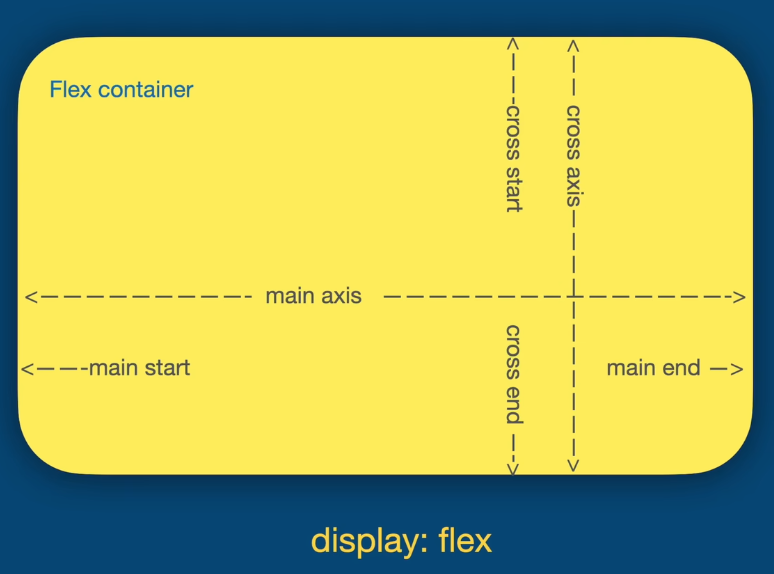
### `flex-direction`
```css
 flex-direction:row
 ```
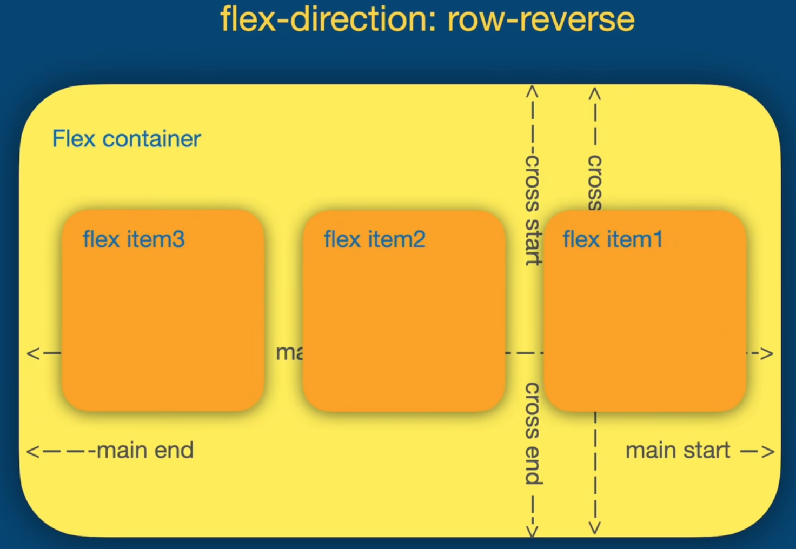
```css
 flex-direction:column
```
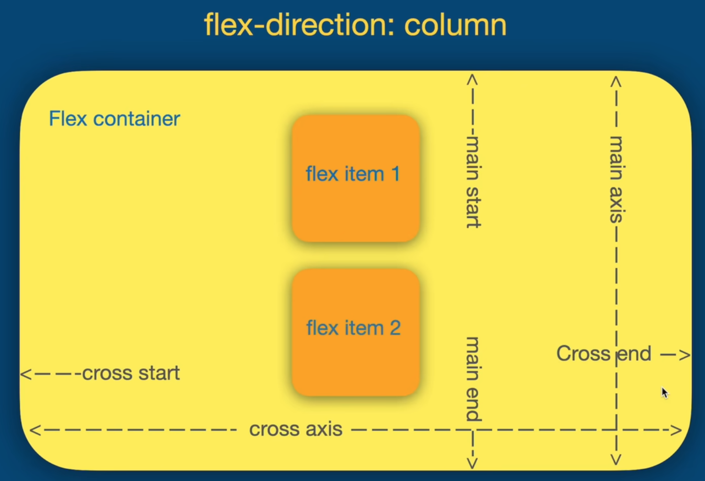
## `flex-basis`&`flex-grow`&`flex-shrink`
```css
.container{
    display:flex;
    width:500px;
}
.item{
    flex-basis:50px;
    /*flex-basis 是flex容器内元素的宽度
    如果被设置为 min-content，则会将宽度设定为最短的word
    如果被设置为 auto（默认值），则与正常布局无异*/
    flex-grow:1;
}
.item:nth-child(1){
    flex-grow:6
}
/* 4(50+x)+50+6x=500 */
/*可以将 flex-basis 设为0 让第一个元素是其他的6倍宽.*/
```
`flex-shrink` 相比 `flex-grow`，把加号变减号即可

`flex: grow shrink basis`  
```css
flex:initial;
/*flex: 0 1 auto*/
flex:auto;
/*flex: 1 1 auto*/
flex:none;
/*flex: 0 0 auto*/
flex:1 0px;
/*平均分*/
```
### `align-items`
manipulate cross axis
```css
.container{
    display:flex;
    width:500px;
    align-items:stretch
    /*'stretch' 是默认值, 意思是把其他元素的高度
    也拉伸到最高元素的高度*/
}
```
```css
align-items:flex-start;
align-items:flex-end;
align-items:center;
align-items:baseline;
```
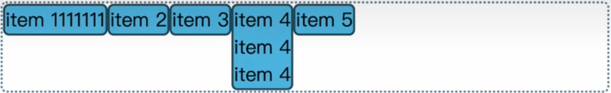
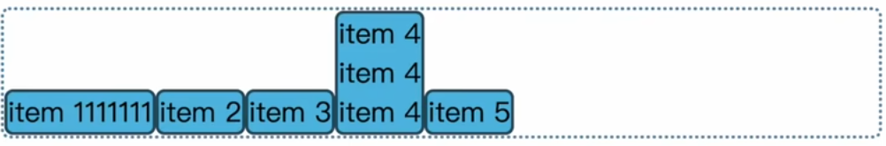
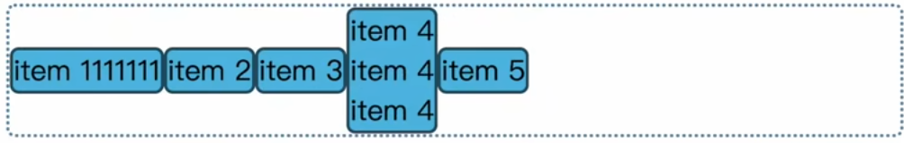
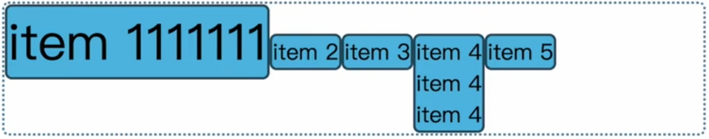
### `justify-content`
manipulate the main axis
```css
justify-content:flex-start
justify-content:flex-end
justify-content:center
justify-content:space-between
justify-content:space-around
justify-content:space-evenly
```
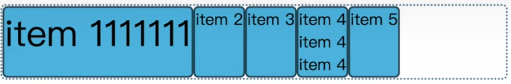
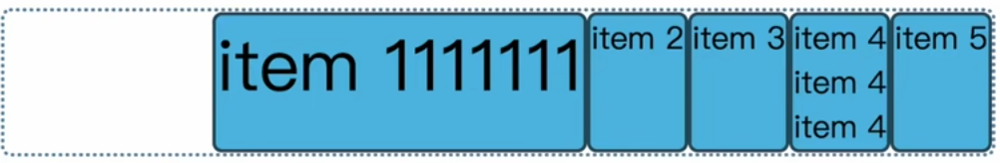
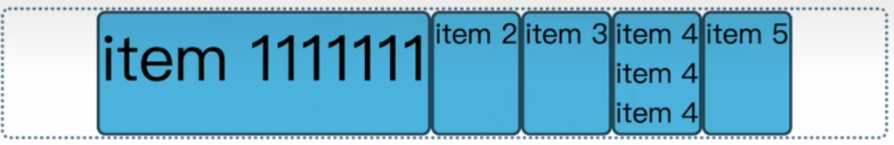
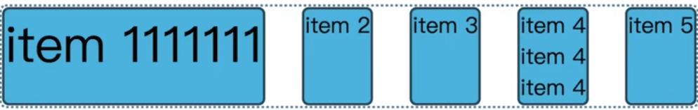
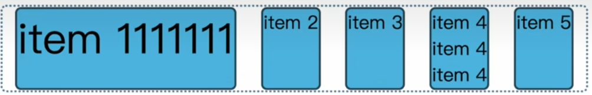
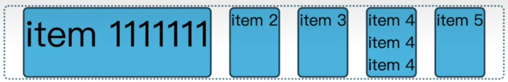
### `flex-wrap`
```css
.container{
    display:flex;
    width:500px;
    height:300px;
    flex-wrap:wrap;
}
.item{
    flex-basis:200px;
}
```
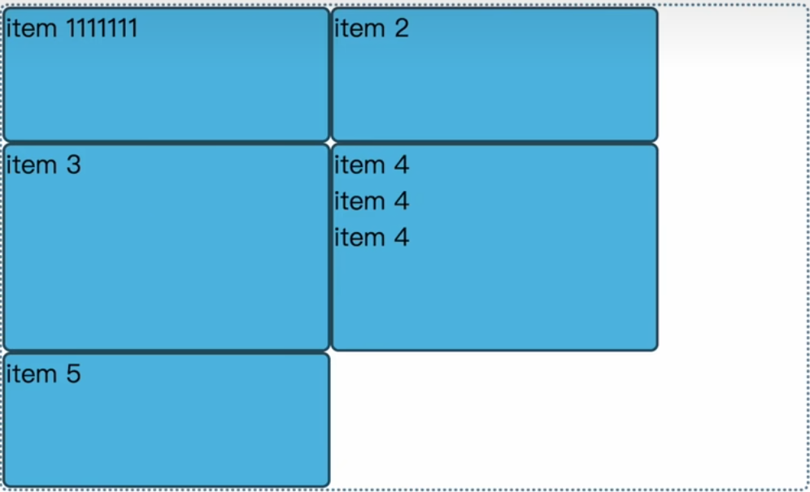
`flex-wrap:wrap-reverse`
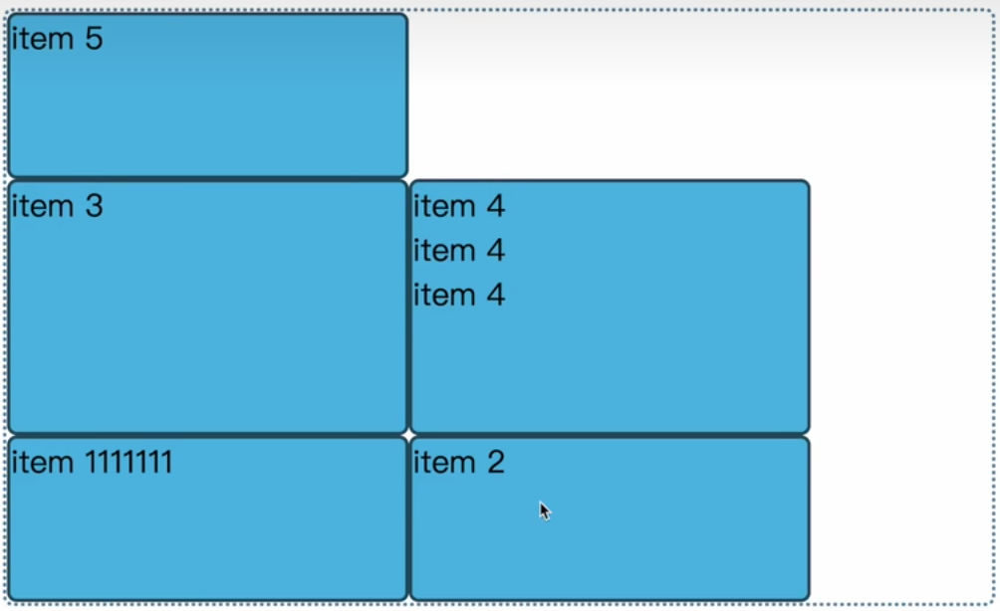
### `align-content`
```css
align-content:flex-start
align-content:flex-end
align-content:space-around
```
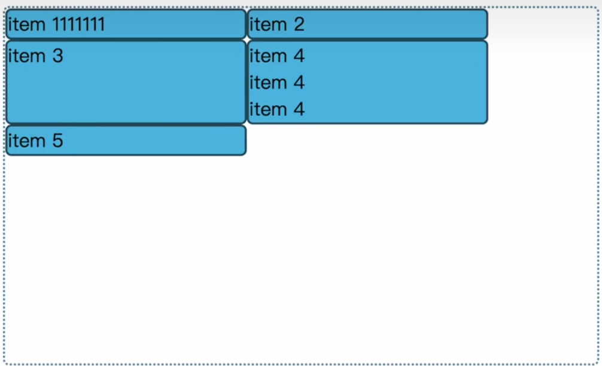
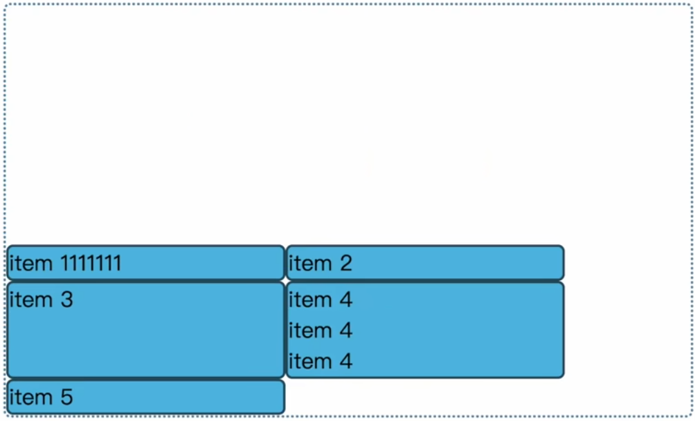
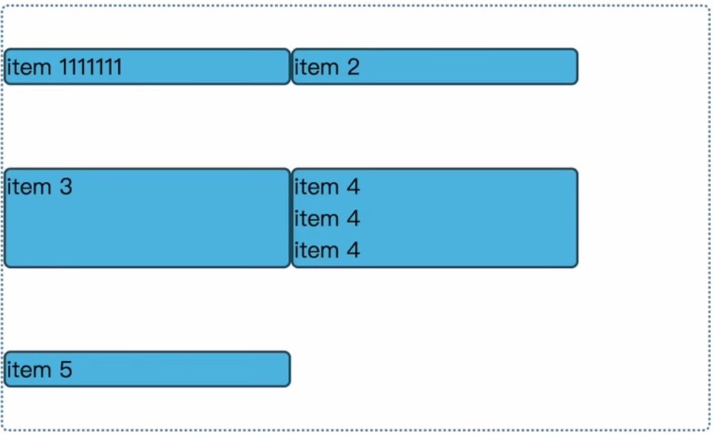
### tip
在flex布局中，弹性容器本身在页面伸缩时可以调整容器宽度，可以配合`max-width`属性使用来限制元素的最大宽度，从而达到一个比较好的效果
## 激动人心的作业环节
用HTML和CSS写一个个人主页，要求必须有一个导航栏，页面充实，内容不限
如果能运用前端框架，也可以用VUE或者REACT写
### 没有什么奖励的bonus
自行学习，把自己写的个人主页挂在github pages上
### 参考页面
#### 简陋版
[浙江大学机械工程学院物理与计算智能课题组](https://www.ligroupzju.com/)
#### 高级版
[浙江大学求是潮](https://www.qsc.zju.edu.cn/)